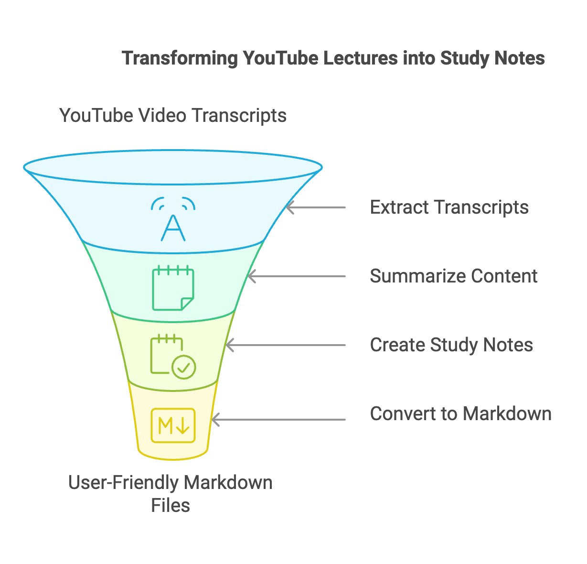

# Tube Summary

Tube Summary is a powerful tool designed to enhance the learning experience by extracting and summarizing educational content from YouTube lectures. This project utilizes advanced language models to download youtube video transcripts, create detailed study notes, and convert these notes into user-friendly markdown files. The primary goal is to help students and lifelong learners efficiently capture and review key information from youtube educational videos/lectures.

## Setup

To get started with Tube Summary, follow these setup instructions:

1. **Install `uv` Package Manager**:

   - Make sure you have `uv` installed in your system. Check this guide [here](https://docs.astral.sh/uv/getting-started/installation/).

2. **Setup Google's Application Default Credentials (ADC)**:

   - Obtain the ADC File: Secure the adc.json file from Google Cloud Console. This file contains your service account credentials essential for authenticating and interacting with Google Cloud services, such as Vertex AI.
   - Create a `.secrets` directory in your project root and place the `.adc.json` file inside it.

3. **Rename and Update `.env` File**:
   - Rename `.env.example` to `.env`.
   - Update all the variables in the `.env` file with the appropriate values.

## Steps to Run

### Step 1: Download captions from any youtube lecture

- **Command**: `uv run STEP_10_00_download_transcripts.py --v <video_id>`

- **Arguments**:

  - --video_id, -v: video id of the youtube urls. E.g, if you want notes from https://www.youtube.com/watch?v=1TU9ZrZhqw0, then the video_id would be 1TU9ZrZhqw0.

- **Output**: A json file containing all thetranscripts will get saved at `output/STEP_10_00_download_transcripts/1TU9ZrZhqw0_transcript_<date-time-now>.json`.

### Step 2: Create study notes using Language Model

- **Description**: This step creates study notes using Language Model. And the results is saved in JSON format.

- **Command**:
  `uv run STEP_20_00_create_study_notes_json.py`
- **Output**: A JSON file with the entire notes is saved at `output/STEP_20_00_create_study_notes_json/<lecture_title>_<date-time-now>.json`.

### Step 3: Convert JSON study notes to markdown

- **Description**: This step takes the json study notes and converts it to a nice markdown, which can be opened and read using Google Docs, MS Word, etc.
- **Command**:
  `uv run STEP_30_00_study_notes_to_markdown.py -v <video_id>`

- **Arguments**:

  - This step requires video_id because it hyperlinks each topic to exact timestamp of the original youtube video.
  - --video_id, -v: video id of the youtube urls. E.g, if you want notes from https://www.youtube.com/watch?v=1TU9ZrZhqw0, then the video_id would be 1TU9ZrZhqw0.

- **Output**: A markdown file with the final notes gets saved at `output/STEP_30_00_study_notes_to_markdown/<lecture_title>_<date-time-now>.md`.

The output of `STEP_30_00_study_notes_to_markdown.py` can be opened in Google Docs/MS Word, and easily read or edited. Enjoy!
